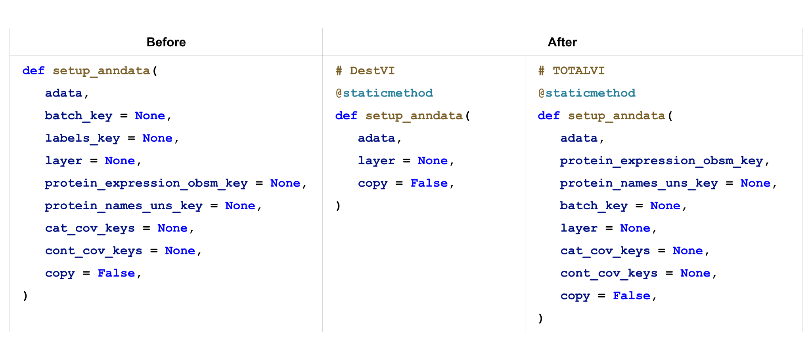

New in 0.14.0 (2021-10-07)
--------------------------

In this release, we have completely revamped the scvi-tools documentation website by creating a new set of user guides that provide: 

a. The math behind each method (in a succinct, online methods-like way) 
b. The relationship between the math and the functions associated with each model 
c. The relationship between math variables and code variables 

Our previous User Guide guide has been renamed to Tutorials and contains all of our existing tutorials (including tutorials for developers).

Another noteworthy addition in this release is the implementation of the (amortized) Latent Dirichlet Allocation (aka LDA) model applied to single-cell gene expression data. We have also prepared a tutorial that demonstrates how to use this model, using a PBMC 10K dataset from 10x Genomics as an example application.

Lastly, in this release we have made a change to reduce user and developer confusion by making the previously global ``setup_anndata`` method a static class-specific method instead. This provides more clarity on which parameters are applicable for this call, for each model class. Below is a before/after for the DESTVI and TOTALVI model classes:

   ``setup_anndata`` before and after

Changes
~~~~~~~
- Added fixes to support PyTorch Lightning 1.4 (`#1103`_)
- Simplified data handling in R tutorials with sceasy and addressed bugs in package installation (`#1122`_).
- Moved library size distribution computation to model init (`#1123`_)
- Updated Contribution docs to describe how we backport patches (`#1129`_)
- Implemented Latent Dirichlet Allocation as a PyroModule (`#1132`_)
- Made ``setup_anndata`` a static method on model classes rather than one global function (`#1150`_)
- Used Pytorch Lightning's ``seed_everything`` method to set seed (`#1151`_)
- Fixed a bug in :class:`~scvi.model.base.PyroSampleMixin` for posterior sampling (`#1158`_)
- Added CITE-Seq datasets (`#1182`_)
- Added user guides to our documentation (`#1127`_, `#1157`_, `#1180`_, `#1193`_, `#1183`_)
- Early stopping now prints the reason for stopping when applicable (`#1208`_)

Breaking changes
~~~~~~~~~~~~~~~~
None!

Contributors
~~~~~~~~~~~~
- `@adamgayoso`_
- `@PierreBoyeau`_
- `@talashuach`_
- `@jjhong922`_
- `@watiss`_
- `@mjayasur`_
- `@vitkl`_

.. _`@adamgayoso`: https://github.com/adamgayoso
.. _`@PierreBoyeau`: https://github.com/PierreBoyeau
.. _`@talashuach`: https://github.com/talashuach
.. _`@jjhong922`: https://github.com/jjhong922
.. _`@watiss`: https://github.com/watiss
.. _`@mjayasur`: https://github.com/mjayasur
.. _`@vitkl`: https://github.com/vitkl

.. _`#1103`: https://github.com/YosefLab/scvi-tools/pull/1103
.. _`#1122`: https://github.com/YosefLab/scvi-tools/pull/1122
.. _`#1123`: https://github.com/YosefLab/scvi-tools/pull/1123
.. _`#1127`: https://github.com/YosefLab/scvi-tools/pull/1127
.. _`#1129`: https://github.com/YosefLab/scvi-tools/pull/1129
.. _`#1132`: https://github.com/YosefLab/scvi-tools/pull/1132
.. _`#1150`: https://github.com/YosefLab/scvi-tools/pull/1150
.. _`#1151`: https://github.com/YosefLab/scvi-tools/pull/1151
.. _`#1157`: https://github.com/YosefLab/scvi-tools/pull/1157
.. _`#1158`: https://github.com/YosefLab/scvi-tools/pull/1158
.. _`#1180`: https://github.com/YosefLab/scvi-tools/pull/1180
.. _`#1182`: https://github.com/YosefLab/scvi-tools/pull/1182
.. _`#1183`: https://github.com/YosefLab/scvi-tools/pull/1183
.. _`#1193`: https://github.com/YosefLab/scvi-tools/pull/1193
.. _`#1208`: https://github.com/YosefLab/scvi-tools/pull/1208