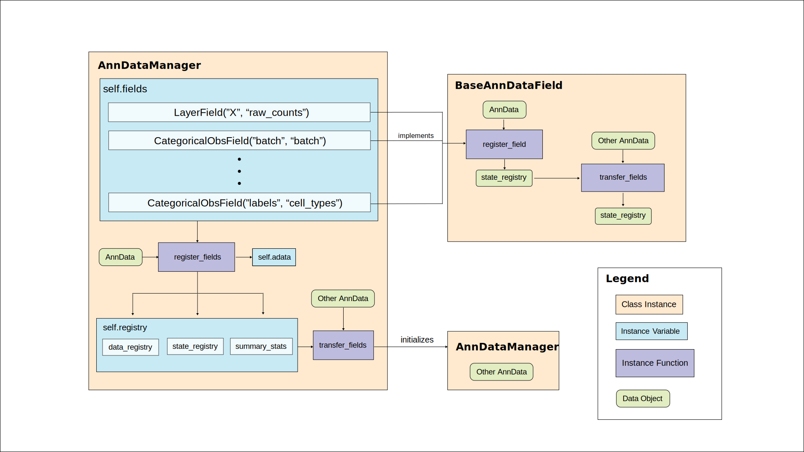

New in 0.15.0 (2021-MM-DD)
--------------------------

In this release, we have completely refactored the logic behind our data handling strategy (i.e. ``setup_anndata``) to allow for: 

a. Readable data handling for existing models.
b. Modular code for easy addition of custom data fields to incorporate into models.
c. Avoidance of unexpected edge cases when more than one model is instantiated in one session.

**Important Note:** This change will not break pipelines for model users (with the exception of a small change to :class:`~scvi.model.SCANVI`).
However, there are several breaking changes for model developers. The data handling tutorial goes over these
changes in detail.

This refactor is centered around the new :class:`~scvi.data.anndata.AnnDataManager` class which orchestrates any data processing necessary
for scvi-tools and stores necessary information, rather than adding additional fields to the AnnData input.

   Schematic of data handling strategy with AnnDataManager

Changes
~~~~~~~
- Major refactor to data handling strategy with the introduction of :class:`~scvi.data.anndata.AnnDataManager` (`#1237`_).
- Prevent clobbering between models using the same AnnData object with model instance specific :class:`~scvi.data.anndata.AnnDataManager` mappings (`#1342`_).
- Add ``size_factor_key`` to :class:`~scvi.model.SCVI`, :class:`~scvi.model.MULTIVI`, :class:`~scvi.model.SCANVI`, and :class:`~scvi.model.TOTALVI` (`#1334`_).
- Add references to the scvi-tools journal publication to the README (`#1338`_, `#1339`_).

Breaking changes
~~~~~~~~~~~~~~~~
- ``setup_anndata`` is now a class method on model classes and requires specific function calls to ensure proper :class:`~scvi.data.anndata.AnnDataManager` setup and model save/load.
  Any model inheriting from :class:`~scvi.model.base.BaseModelClass` will need to re-implement this method (`#1237`_).
- :class:`~scvi.model.SCANVI` now takes ``unlabeled_category`` as an argument to :meth:`~scvi.model.SCANVI.setup_anndata` rather than on initialization (`#1237`_).
- The keyword argument ``run_setup_anndata`` has been removed from built-in datasets since there is no longer a model-agnostic ``setup_anndata`` method (`#1237`_).
- The function ``scvi.model._metrics.clustering_scores`` has been removed due to incompatbility with new data handling (`#1237`_).

Contributors
~~~~~~~~~~~~
- `@adamgayoso`_
- `@jjhong922`_
- `@watiss`_

.. _`@adamgayoso`: https://github.com/adamgayoso
.. _`@jjhong922`: https://github.com/jjhong922
.. _`@watiss`: https://github.com/watiss

.. _`#1237`: https://github.com/YosefLab/scvi-tools/pull/1237
.. _`#1334`: https://github.com/YosefLab/scvi-tools/pull/1334
.. _`#1338`: https://github.com/YosefLab/scvi-tools/pull/1338
.. _`#1339`: https://github.com/YosefLab/scvi-tools/pull/1339
.. _`#1342`: https://github.com/YosefLab/scvi-tools/pull/1342
