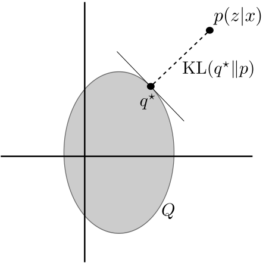

==============================
Variational Inference
==============================

Suppose we have data :math:`x` that we assume are generated via latent variables :math:`z`. In the case of a simplified :class:`scvi.model.SCVI` the data would
be gene expression counts and the latent variable would be the low-dimensional representation that corresponds to cellular state.

For many interesting models, including all the models in this package, the posterior distribution of :math:`z`

.. math::
   :nowrap:

    \begin{align}
    p(z\mid x) & =\frac{p(x \mid z)p(z)}{p(x)},
    \end{align}

is intractable because the denominator, which is defined via integral cannot be computed analytically:

.. math::
   :nowrap:

    \begin{align}
    p(x) & =\int p(x\mid z)p(z)\, dz.
    \end{align}

Approximating the posterior
===========================

With variational inference [#ref1]_, we cast the problem of finding the posterior distribution into an optimization problem by minimizing the KL divergence
between an approximate posterior distribution :math:`q` that belongs to some *family* of approximate densities
:math:`Q` and the true posterior. As an example, if :math:`Q` is the family of multivariate Gaussians, then we would like to find the optimal
mean and covariance matrix.

   Abstraction of the variational inference problem. We seek to find an approximate posterior distribution that minimizes the KL divergence.

Using Bayes Rule, we may rewrite this problem into something we can actually compute.

.. math::
   :nowrap:

    \begin{align}
        q^\star &= \mathop{\arg \min}_{q \in Q} \mathrm{KL}(\,q(z)\, \| \,p(z \mid x)\,)\\
        &= \mathop{\arg \min}_{q \in Q} \mathbb E_{q} \left[  \log q(z) - \log p(z \mid x) \right]\\
        &= \mathop{\arg \min}_{q \in Q} \mathbb E_{q} \left[ \log q(z) - \log p(z, x) \right] + \log p(x)\\
        &= \mathop{\arg \min}_{q \in Q} \mathbb E_{q} \left[ \log q(z) - \log p(z, x) \right].
    \end{align}

Manipulation of the last line allows us to rewrite the optimization problem as

.. math::
   :nowrap:

    \begin{align}
        q^\star &= \mathop{\arg \max}_{q \in Q} \mathbb E_{q} \left[\log p(x \mid z)\right] -  \mathrm{KL}(\,q(z)\, \| \,p(z)\,)
    \end{align}

where the first term is often called the "reconstruction error" and the second term as the KL divergence or "regularizer". Presenting the problem this way reveals that
the approximate posterior should provide samples that results in high probability of the data (reconstruction) while also being "close" to the prior :math:`p(z)` (KL divergence).

End to end learning
=====================

So far we have an optimization problem that enables us to learn an approximation of the true posterior.
It is often also the case that we have model parameters :math:`\theta` such that we can write the
probability of the data as :math:`p_\theta(x)`. In addition, :math:`\theta` may be unknown.
In the case of scVI, :math:`\theta` would include the parameters of the decoder neural networks.

In addition to the model parameters :math:`\theta`, let :math:`\phi` be the parameters of the approximate posterior (e.g., mean and covariance matrix if :math:`Q` is
the family of multivariate Gaussians). Using the derivation above, we can express the log probability of the data as

.. math::
   :nowrap:

    \begin{align}
        p_\theta(x) &= \mathrm{KL}(\,q_\phi(z)\, \| \,p_\theta(z \mid x)\,) + \mathbb E_{q} \left[\log p_\theta(x \mid z)\right] -  \mathrm{KL}(\,q_\phi(z)\, \| \,p_\theta(z)\,)\\
        &= \mathrm{KL}(\,q_\phi(z)\, \| \,p_\theta(z \mid x)\,) + \mathrm{ELBO}.
    \end{align}

where the Evidence Lower Bound is the quantity we derived previously:

.. math::
   :nowrap:

    \begin{align}
        \mathrm{ELBO} := \mathbb E_{q} \left[\log p_\theta(x \mid z)\right] -  \mathrm{KL}(\,q_\phi(z)\, \| \,p_\theta(z)\,).
    \end{align}

This quantity is aptly named as it lower bounds the log probability of the data, or the evidence due to the fact that the KL divergence is non-negative by definition:

.. math::
   :nowrap:

    \begin{align}
        p_\theta(x) &= \mathrm{KL}(\,q_\phi(z)\, \| \,p_\theta(z \mid x)\,) + \mathrm{ELBO}\\
        p _\theta(x) &\geq \mathrm{ELBO}
    \end{align}

It turns out that we can maximize the ELBO with respect to both the model parameters :math:`\theta` and the variational parameters :math:`\phi`, which gives us both
estimates of :math:`\theta` and an approximate posterior on the latent variables. This can also be stated as minimizing our original KL divergence :math:`\mathrm{KL}(\,q_\phi(z)\, \| \,p_\theta(z \mid x)\,)`,
but with a true posterior that is a moving target (as it is a function of :math:`\theta`).

Amortizing inference
=====================

Let's think about our high-dimensional single-cell data. If we have a model where we want to learn a posterior for a low-dimensional latent variable :math:`z`, then there will be an approximate posterior
mean and variance parameter associated with each single cell. This scales linearly with the number of cells in our dataset.

To amortize the cost of inference, we can tie together all cells using a neural network. Now suppose that we feed each cell's gene expression :math:`x` through a neural network that outputs the mean and variance
of :math:`q(z)` for that cell. Inference will tend to be more scalable as the variational parameters are global (shared by all cells). On the other hand, we may pay a cost called the *amortization gap* for this sharing.

Overall, this technique is typicall called *amortized variational inference* and in some cases *auto-encoding variational bayes* [#ref2]_.

.. topic:: References:

   .. [#ref1] Blei, David M., Alp Kucukelbir, and Jon D. McAuliffe (2017),
        *Variational inference: A review for statisticians.*,
        Journal of the American statistical Association.

   .. [#ref2] Kingma, Diederik P., and Max Welling (2019),
        *An introduction to variational autoencoders.*,
        arXiv preprint arXiv:1906.02691.

