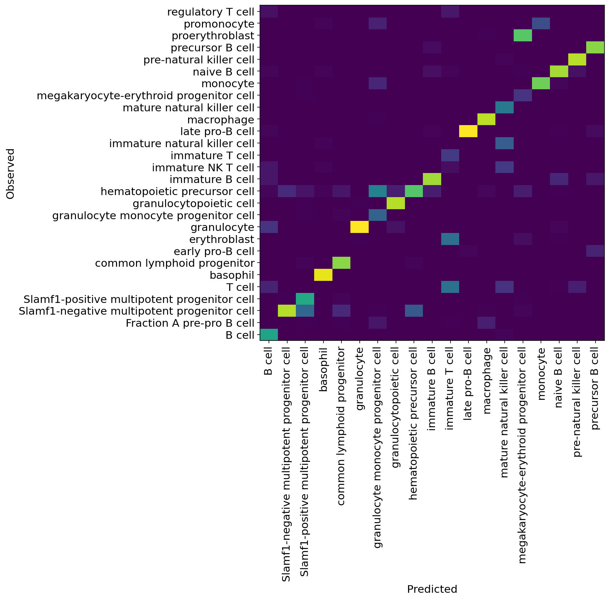

User guide
==========

The easiest way to get familiar with scvi-tools is to follow along with our tutorials.
Many are also designed to work seamlessly in Google Colab, a free cloud computing platform. These tutorials have a Colab badge in their introduction. In general, these tutorials are designed to work with the latest installable version of scvi-tools.

To download the tutorials:

1. Follow the Colab link within the tutorial (if available).
2. Download it with the option in the file menu.

.. note:: For questions about using scvi-tools, or broader questions about modeling data, please use our forum_.

.. _forum: https://discourse.scvi-tools.org/

Quick start
-----------

.. raw:: html

    

        

            

                

                
                

                    <h5 class="card-title">Quick guide to scvi-tools</h5>
                    
Rapidly learn the basics to run any of the scvi-tools models.
                    

.. container:: custom-button

    :doc:`GO<notebooks/api_overview>`

.. raw:: html

                

                

            

            

                

                
                

                    <h5 class="card-title">Data loading and prep</h5>
                    
How do I get my data prepared for scvi-tools?

.. container:: custom-button

    :doc:`GO<notebooks/data_loading>`

.. raw:: html

                

                

            

        

    

Tutorials
---------

.. raw:: html

    

    

        

            

                

                    

                        <button class="btn btn-dark btn-sm"></button>
                        Analysis of paired RNA and protein data with totalVI
                    

                    

:doc:`Straight to tutorial...<notebooks/totalVI>`

.. raw:: html

                    
                

            

            

                

This is a walkthrough of a totalVI-based analysis pipeline, from dimension reduction to differential expression.

.. image:: ../_static/tutorials/totalvi_cell.svg
   :align: center
   :height: 300px

.. raw:: html

                    

                        

:doc:`To the tutorial <notebooks/totalVI>`

.. raw:: html

                        
                    

                

            

        

        

            

                

                    

                        <button class="btn btn-dark btn-sm"></button>
                        Atlas-level integration and label transfer
                    

                    

:doc:`Straight to tutorial...<notebooks/harmonization>`

.. raw:: html

                    
                

            

            

                

Here we describe how to use scVI and scANVI for integrating data from Tabula Muris.

.. raw:: html

                    

                        

:doc:`To the tutorial <notebooks/harmonization>`

.. raw:: html

                        
                    

                

            

        

        

            

                

                    

                        <button class="btn btn-dark btn-sm"></button>
                        Interpretable factor model of scVI
                    

                    

:doc:`Straight to tutorial...<notebooks/linear_decoder>`

.. raw:: html

                    
                

            

            

                

It's scVI, but with PCA-like interpretability.

.. image:: ../_static/tutorials/ldvae.svg
   :align: center
   :height: 300px

.. raw:: html

                    

                        

:doc:`To the tutorial <notebooks/linear_decoder>`

.. raw:: html

                        
                    

                

            

        

        

            

                

                    

                        <button class="btn btn-dark btn-sm"></button>
                        Integration of CITE-seq and scRNA-seq data
                    

                    

:doc:`Straight to tutorial...<notebooks/cite_scrna_integration_w_totalVI>`

.. raw:: html

                    
                

            

            

                

totalVI can be used to integrate datasets from CITE-seq (RNA + protein) and datasets with only RNA (scRNA-seq). Integration enables imputation of missing proteins in the cells measured with scRNA-seq.

.. raw:: html

                    

                        

:doc:`To the tutorial <notebooks/cite_scrna_integration_w_totalVI>`

.. raw:: html

                        
                    

                

            

        

        

            

                

                    

                        <button class="btn btn-dark btn-sm"></button>
                        Interoperability with R and Seurat
                    

                    

:doc:`Straight to tutorial...<notebooks/scvi_in_R>`

.. raw:: html

                    
                

            

            

                

scvi-tools can be used interfaced directly from R. Learn the basics here.

.. raw:: html

                    

                        

:doc:`To the tutorial <notebooks/scvi_in_R>`

.. raw:: html

                        
                    

                

            

        

        

            

                

                    

                        <button class="btn btn-dark btn-sm"></button>
                        Online updates of scvi-tools models via the scArches method
                    

                    

:doc:`Straight to tutorial...<notebooks/scarches_scvi_tools>`

.. raw:: html

                    
                

            

            

                

scVI, scANVI, and totalVI can be pre-trained on large reference datasets and updated sequentially with query datasets in an online fashion.
This technique uses the method of scArches and enables rapid, and robust integration.

.. raw:: html

                    

                        

:doc:`To the tutorial <notebooks/scarches_scvi_tools>`

.. raw:: html

                        
                    

                

            

        

        

            

                

                    

                        <button class="btn btn-dark btn-sm"></button>
                        Integration of spatial and sequencing data
                    

                    

:doc:`Straight to tutorial...<notebooks/gimvi_tutorial>`

.. raw:: html

                    
                

            

            

                

gimVI can be used to integrate spatial and sequencing data. Integration enables imputation of missing genes in the cells measured with a spatial technology.

.. raw:: html

                    

                        

:doc:`To the tutorial <notebooks/gimvi_tutorial>`

.. raw:: html

                        
                    

                

            

        

        

            

                

                    

                        <button class="btn btn-dark btn-sm"></button>
                        Identification of zero-inflated genes
                    

                    

:doc:`Straight to tutorial...<notebooks/AutoZI_tutorial>`

.. raw:: html

                    
                

            

            

                

AutoZI can be used to determine which genes are zero-inflated. This can be extended to finding cell-type specific zero-inflation.

.. raw:: html

                    

                        

:doc:`To the tutorial <notebooks/AutoZI_tutorial>`

.. raw:: html

                        
                    

                

            

        

    

    

User-contributed tutorials
--------------------------

.. raw:: html

    

    

        

            

                

                    

                        <button class="btn btn-dark btn-sm"></button>
                        Differential expression on Packer C. elegans data
                    

                    

:doc:`Straight to tutorial...<notebooks/scVI_DE_worm>`

.. raw:: html

                    
                

            

            

                

This tutorial was contributed by Eduardo Beltrame.

.. raw:: html

                    

                        

:doc:`To the tutorial <notebooks/scVI_DE_worm>`

.. raw:: html

                        
                    

                

            

        

    

    

.. toctree::
   :maxdepth: 1
   :hidden:

   notebooks/api_overview
   notebooks/data_loading
   notebooks/totalVI
   notebooks/harmonization
   notebooks/linear_decoder
   notebooks/cite_scrna_integration_w_totalVI
   notebooks/scvi_in_R
   notebooks/scarches_scvi_tools
   notebooks/gimvi_tutorial
   notebooks/AutoZI_tutorial
   notebooks/scVI_DE_worm