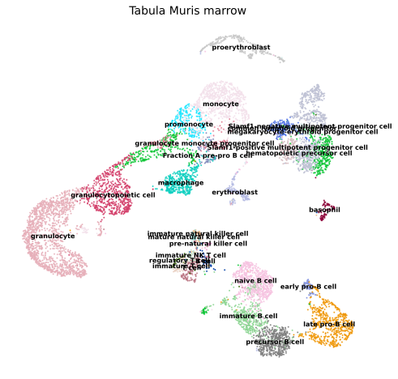
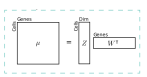

User guide
==========

|Open In Colab|

.. |Open In Colab| image:: https://colab.research.google.com/assets/colab-badge.svg
    :target: https://colab.research.google.com/github/yoseflab/scVI/blob/stable

The easiest way to get familiar with scvi-tools is to follow along with our tutorials.
The tutorials are accessible on the sidebar to the left. They are also designed to work seamlessly in Google Colab, a free cloud computing platform. These tutorials have a Colab badge in their introduction. In general, these tutorials are designed to work with the latest installable version of scvi-tools.

To download the tutorials:

1. Click the Colab within the tutorial (if available).
2. Download it with the option in the file menu.

Quick start
-----------

.. raw:: html

    

        

            

                

                
                

                    <h5 class="card-title">Quick guide to scvi-tools</h5>
                    
Rapidly learn the basics to run any of the scvi-tools models.
                    

.. container:: custom-button

    :doc:`GO<notebooks/api_overview>`

.. raw:: html

                

                

            

            

                

                
                

                    <h5 class="card-title">Data loading and prep</h5>
                    
How do I get my data prepared for scvi-tools?

.. container:: custom-button

    :doc:`GO<notebooks/data_loading>`

.. raw:: html

                

                

            

        

    

Tutorials
---------

.. raw:: html

    

    

        

            

                

                    

                        <button class="btn btn-dark btn-sm"></button>
                        Analysis of paired RNA and protein data with totalVI
                    

                    

:doc:`Straight to tutorial...<notebooks/totalVI>`

.. raw:: html

                    
                

            

            

                

This is a walkthrough of a totalVI-based analysis pipeline, from dimension reduction to differential expression.

.. image:: ../_static/tutorials/totalvi_cell.svg
   :align: center
   :height: 300px

.. raw:: html

                    

                        

:doc:`To the tutorial <notebooks/totalVI>`

.. raw:: html

                        
                    

                

            

        

        

            

                

                    

                        <button class="btn btn-dark btn-sm"></button>
                        scRNA-seq atlas-level integration and label transfer with scVI and scANVI
                    

                    

:doc:`Straight to tutorial...<notebooks/harmonization>`

.. raw:: html

                    
                

            

            

                

TODO

.. raw:: html

                    

                        

:doc:`To the tutorial <notebooks/harmonization>`

.. raw:: html

                        
                    

                

            

        

        

            

                

                    

                        <button class="btn btn-dark btn-sm"></button>
                        Interpretable factor model of scVI
                    

                    

:doc:`Straight to tutorial...<notebooks/linear_decoder>`

.. raw:: html

                    
                

            

            

                

It's scVI, but with PCA-like interpretability.

.. raw:: html

                    

                        

:doc:`To the tutorial <notebooks/linear_decoder>`

.. raw:: html

                        
                    

                

            

        

    

    

User-contributed tutorials
--------------------------

.. raw:: html

    

    

        

            

                

                    

                        <button class="btn btn-dark btn-sm"></button>
                        Differential expression on Packer C. elegans data
                    

                    

:doc:`Straight to tutorial...<notebooks/contributed/scVI_DE_worm>`

.. raw:: html

                    
                

            

            

                

.. raw:: html

                    

                        

:doc:`To the tutorial <notebooks/contributed/scVI_DE_worm>`

.. raw:: html

                        
                    

                

            

        

    

    

.. toctree::
   :maxdepth: 1
   :hidden:

   notebooks/api_overview
   notebooks/data_loading
   notebooks/totalVI
   notebooks/cite_scrna_integration_w_totalVI
   notebooks/harmonization
   notebooks/AutoZI_tutorial
   notebooks/gimvi_tutorial
   notebooks/linear_decoder
   autotune
   notebooks/contributed/scVI_DE_worm
