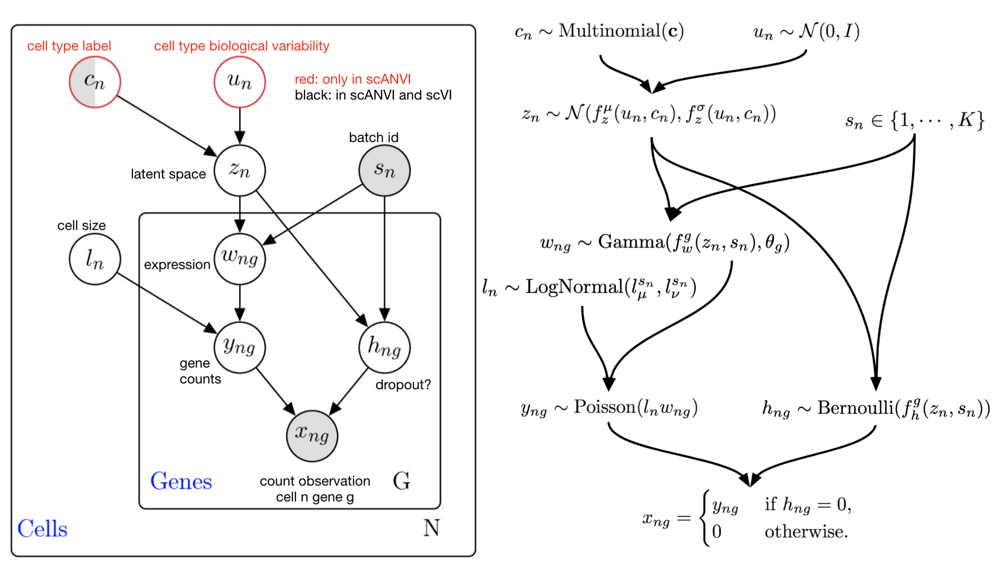

======
scANVI
======

**scANVI** [#ref1]_ (single-cell ANnotation using Variational Inference; Python class :class:`~scvi.model.SCANVI`) is a semi-supervised model for single-cell transcriptomics data.
In a sense, it can be seen as a scVI extension that can leverage the cell type knowledge for a subset of the cells present in the data sets to infer the states of the rest of the cells.
For this reason, scANVI can help annotate a data set of unlabelled cells from manually annotated atlases, e.g., Tabula Sapiens [#refTS]_.

The advantages of scANVI are:

- Comprehensive in capabilities.
- Scalable to very large datasets (>1 million cells).

The limitations of scANVI include:

- Effectively requires a GPU for fast inference.
- Latent space is not interpretable, unlike that of a linear method.
- May not scale to very large number of cell types.

.. topic:: Tutorials:

 - :doc:`/tutorials/notebooks/harmonization`
 - :doc:`/tutorials/notebooks/scarches_scvi_tools`

Preliminaries
==============
scANVI takes as input a scRNA-seq gene expression matrix :math:`X` with :math:`N` cells and :math:`G` genes,
as well as a vector :math:`c` containing the partially observed cell type annotations.
Additionally, a design matrix :math:`S` containing :math:`p` observed covariates, such as day, donor, etc, is an optional input.
While :math:`S` can include both categorical covariates and continuous covariates, in the following, we assume it contains only one
categorical covariate with :math:`K` categories, which represents the common case of having multiple batches of data.

Generative process
============================

While scVI, scANVI directly models discrete cell types in its generative model, and uses this knowledge to better structure cell states :math:`z_n`, following a graphical model inspired by works on semi-supervised VAEs [#ref2]_.
:math:`z_n` is characterized by its discrete type :math:`c_n` and its within-type identity :math:`u_n`.
The following figure illustrates these dependencies.

we assume a categorical distribution for cell types, such that :math:`c \sim \textrm{Discrete}(\pi)`, where :math:`\pi` is in the simplex.
scANVI does not use empirical Bayes to determine :math:`\pi` to avoid exacerbating type proportion bias.

We assume that the within-cell-type characterization of the cell follows a  Normal distribution, s.t. :math:`u_n \sim \mathcal{N}(0, I_d)`.

The continuous cell state :math:`z_n` follow a learnable prior

.. math::
   :nowrap:

   \begin{align}
      z_n \sim \mathcal{N}(\mu_\theta(c_n, u_n), \sigma_\theta(c_n, u_n) \odot I_d)
   \end{align}

The rest of the model closely follows scVI.
In particular, it represents the library size as a random variable, and gene expression likelihoods as negative binomial distributions parameterized by functions of :math:`z_n, l_n`, condition to the batch assignments :math:`s_n`.

However, for the sake of clarity, we ignore the library size and batch sizes from the following arguments.

Inference
========================

scANVI assumes the following factorization for the inference model

.. math::
   :nowrap:

   \begin{align}
      q_\phi(z_n, u_n, c_n \mid x_n)
      =
      q_\phi(z_n, x_n)
      q_\phi(c_n \mid z_n)
      q_\phi(u_n \mid c_n, z_n)
   \end{align}

We make several observations here.
First, each of those variational distributions will be parameterized by neural networks.
Second, while :math:`q_\phi(z_n, x_n)` and :math:`q_\phi(u_n \mid c_n, z_n)` are assumed Gaussian, :math:`q_\phi(c_n \mid z_n)` corresponds to a Categorical distribution over cell types.
In particular, the variational distribution :math:`q_\phi(c_n \mid z_n)` can predict cell types for any cell.

Training details
^^^^^^^^^^^^^^^^

scANVI optimizes evidence lower bounds (ELBO) on the log evidence.
However, the evidence and hence the ELBO have a different expression for cells with observed and unobserved cell types.

First, assume that we observe both gene expressions :math:`x_n` and type assignments :math:`c_n`.
In that case, we bound the log evidence as

.. math::
   :nowrap:

   \begin{align}
    p_\theta(x_n, c_n)
    \geq
    \mathbb{E}_{q_\phi(z_n \mid x_n)
        q_\phi(u_n \mid z_n, c_n)}
    \left[
        \log
        \frac
        {
        p_\theta(x_n, c_n, z_n, u_n)
        }
        {
        q_\phi(z_n \mid x_n)
        q_\phi(u_n \mid z_n, c_n)
        }
    \right]
    =: \mathcal{L}_S
   \end{align}

We aim to optimize for :math:`\theta, \phi` the right-hand side of this equation using stochastic gradient descent.
Gradient updates for the generative model parameters :math:`\theta` are easy to get.
In that case, the gradient of the expectation corresponds to the expectation of the gradients.

However, this is not the case when we differentiate for :math:`\phi`.
The reparameterization trick solves this issue and applies to the (Gaussian) distributions associated with :math:`q_\phi(z_n \mid x_n)
,q_\phi(u_n \mid z_n, c_n)`.
In particular, we can write :math:`\mathcal{L}_S` as an expectation under noise distributions independent of :math:`\phi`.
For convenience, we will write expectations of the form :math:`\mathbb{E}_{\epsilon_v}` to denote expectation under the variational distribution using the reparameterization trick.
We refer the reader to [#ref3]_ for additional insight on the reparameterization trick.

.. math::
   :nowrap:

   \begin{align}
    \nabla_\phi \mathcal{L}_S
    :=
    \mathbb{E}_{\epsilon_z, \epsilon_u}
    \left[
        \nabla_\phi
        \log
        \frac
        {
        p_\theta(x_n, c_n, z_n, u_n)
        }
        {
        q_\phi(z_n \mid x_n)
        q_\phi(u_n \mid z_n, c_n)
        }
    \right]
    =: \mathcal{L}_S
   \end{align}

Things get trickier in the unobserved cell type case.
In this setup, the ELBO corresponds to the right-hand side of

.. math::
   :nowrap:

   \begin{align}
    p_\theta(x_n)
    \geq
    \mathbb{E}_{
        q_\phi(z_n \mid x_n)
        q_\phi(c_n \mid z_n)
        q_\phi(u_n \mid z_n, c_n)
    }
    \left[
        \log
        \frac
        {
        p_\theta(x_n, c_n, z_n, u_n)
        }
        {
        q_\phi(z_n \mid x_n)
        q_\phi(c_n \mid z_n)
        q_\phi(u_n \mid z_n, c_n)
        }
    \right]=:\mathcal{L}_u
   \end{align}

Unfortunately, the reparameterization trick does not apply naturally to :math:`q_\phi(c_n \mid z_n)`.
As an alternative, we observe that

.. math::
   :nowrap:

   \begin{align}
    \mathcal{L}_u
    =
    \mathbb{E}_{
        \epsilon_z
    }
    \left[
        \sum_{c=1}^C
        q_\phi(c_n=c \mid z_n)
        \mathbb{E}_{\epsilon_u}
            \left[
            \log
            \frac
            {
            p_\theta(x_n, c_n=c, z_n, u_n)
            }
            {
            q_\phi(z_n \mid x_n)
            q_\phi(c_n \mid z_n)
            q_\phi(u_n \mid z_n, c_n=c)
            }
        \right]
    \right]
   \end{align}

In this form, we can differentiate :math:`\mathcal{L}_u` with respect to the inference network parameters, as

.. math::
   :nowrap:

   \begin{align}
    \nabla_\phi \mathcal{L}_u
    =
    \mathbb{E}_{
        \epsilon_z
    }
    \left[
        \sum_{c=1}^C
        \nabla_\phi
        \left(
            q_\phi(c_n=c \mid z_n)
            \mathbb{E}_{\epsilon_u}
                \left[
                \log
                \frac
                {
                p_\theta(x_n, c_n=c, z_n, u_n)
                }
                {
                q_\phi(z_n \mid x_n)
                q_\phi(c_n \mid z_n)
                q_\phi(u_n \mid z_n, c_n=c)
                }
        \right)
        \right]
    \right]
   \end{align}

In other words, we will need to marginalize :math:`c_n` out to circumvent the fact that categorical distributions cannot use the reparameterization trick.

Overall, we optimize :math:`\mathcal{L}_U + \mathcal{L}_S` to train the model on both labeled and unlabelled data.

.. topic:: References:

    .. [#ref1] Xu Chenling, Romain Lopez, Edouard Mehlman, Jeffrey Regier, Michael I. Jordan, Nir Yosef (2021),
        *Probabilistic harmonization and annotation of single‐cell transcriptomics data with deep generative models*,
        `Molecular systems biology 17.1 <https://www.embopress.org/doi/epdf/10.15252/msb.20209620>`__.

    .. [#refTS] Tabula Sapiens Consortium (2021),
        *The Tabula Sapiens: a single cell transcriptomic atlas of multiple organs from individual human donors*,
        `BioRxiv <https://www.biorxiv.org/content/10.1101/2021.07.19.452956v1.full.pdf>`__.

    .. [#ref2] Diederik P. Kingma, Shakir Mohamed, Danilo Jimenez Rezende, and Max Welling (2014),
        *Semi-supervised learning with deep generative models*,
        `Advances in neural information processing systems <https://proceedings.neurips.cc/paper/2014/file/d523773c6b194f37b938d340d5d02232-Paper.pdf>`__.

    .. [#ref3] Diederik P. Kingma, Max Welling (2013) (2014),
        *Auto-Encoding Variational Bayes*,
        `Arxiv <https://arxiv.org/abs/1312.6114>`__.
