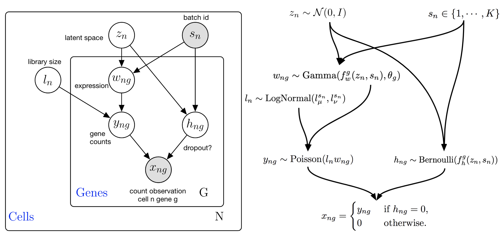

===========
scVI
===========

**scVI** [#ref1]_ posits a flexible generative model of scRNA-seq count data that can subsequently
be used for many common downstream tasks.

The advantages of scVI are:

    + Comprehensive in capabilities.

    + Scalable to very large datasets (>1 million cells).

The disadvantages of scVI include:

    + Effectively requires a GPU for fast inference.

    + Latent space is not interpretable, unlike that of a linear method.

.. topic:: Tutorials:

 - :doc:`/tutorials/notebooks/api_overview`
 - :doc:`/tutorials/notebooks/harmonization`
 - :doc:`/tutorials/notebooks/scarches_scvi_tools`
 - :doc:`/tutorials/notebooks/scvi_in_R`

Preliminaries
==============
scVI takes as input a scRNA-seq gene expression matrix :math:`X` with :math:`N` cells and :math:`G` genes.
Additionally, a design matrix :math:`S` containing :math:`p` observed covariates, such as day, donor, etc, is an optional input.

Generative process
========================

Inference
========================

Tasks
=====

Dimensionality reduction
-------------------------

Normalization and denoising of expression
------------------------------------------

Differential expression
-----------------------

Data simulation
---------------

.. topic:: References:

   .. [#ref1] Romain Lopez, Jeffrey Regier, Michael Cole, Michael I. Jordan, Nir Yosef (2018),
        *Deep generative modeling for single-cell transcriptomics*,
        `Nature Methods <https://www.nature.com/articles/s41592-018-0229-2.epdf?author_access_token=5sMbnZl1iBFitATlpKkddtRgN0jAjWel9jnR3ZoTv0P1-tTjoP-mBfrGiMqpQx63aBtxToJssRfpqQ482otMbBw2GIGGeinWV4cULBLPg4L4DpCg92dEtoMaB1crCRDG7DgtNrM_1j17VfvHfoy1cQ%3D%3D>`__.

