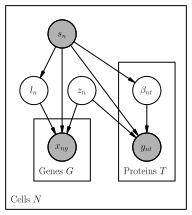

===========
totalVI
===========

**totalVI** [#ref1]_ posits a flexible generative model of CITE-seq RNA and protein data that can subsequently
be used for many common downstream tasks.

The advantages of totalVI are:

    + Comprehensive in capabilities.

    + Scalable to very large datasets (>1 million cells).

The disadvantages of totalVI include:

    + Effectively requires a GPU for fast inference.

    + Difficult to understand the balance between RNA and protein data in the low-dimensional representation of cells.

.. topic:: Tutorials:

 - :doc:`/user_guide/notebooks/totalVI`
 - :doc:`/user_guide/notebooks/cite_scrna_integration_w_totalVI`
 - :doc:`/user_guide/notebooks/scarches_scvi_tools`

Preliminaries
==============
totalVI takes as input a scRNA-seq gene expression matrix :math:`X` with :math:`N` cells and :math:`G` genes
along with a paired matrix of protein abundance, also of :math:`N` cells, but with :math:`T` proteins.
Thus, for each cell, we observe RNA and protein information.
Additionally, a design matrix :math:`D` containing :math:`p` observed covariates, such as day, donor, etc, is an optional input.

Generative process
========================

Inference
========================

Tasks
=====

Dimensionality reduction
-------------------------

Normalization and denoising of expression
------------------------------------------

Differential expression
-----------------------

Data simulation
---------------

.. topic:: References:

   .. [#ref1] Adam Gayoso*, Zoë Steier*, Romain Lopez, Jeffrey Regier, Kristopher L Nazor, Aaron Streets, Nir Yosef (2021),
        *Joint probabilistic modeling of single-cell multi-omic data with totalVI*,
        `Nature Methods <https://www.nature.com/articles/s41592-020-01050-x>`__.

